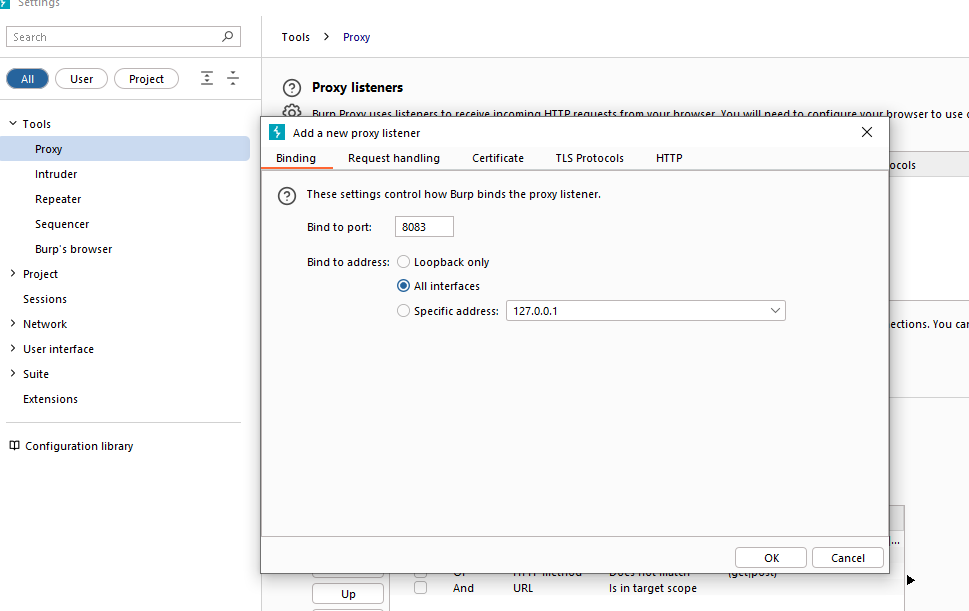
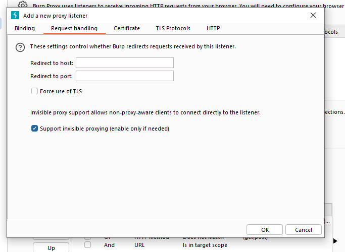

# Bypassing SSL Pinning in a Flutter Android Application

## Introduction

SSL pinning is a security mechanism used to enhance the security of mobile applications by ensuring that only specific SSL certificates are accepted during the SSL handshake process. Mobile applications  including those created with Flutter often employ the SSL pinning technique

But, in certain scenarios, like during security testing or debugging, it may be necessary to bypass SSL pinning to intercept and analyze application traffic. This report provides a step-by-step guide on how to bypass SSL pinning in a Flutter Android application using the Reflutter framework and Burp Suite. This framework helps with Flutter apps reverse engineering using the patched version of the Flutter library which is already compiled and ready for app repacking. This library has snapshot deserialization process modified to allow you perform dynamic analysis in a convenient way.


### Prerequisites:
- A Flutter Android application with SSL pinning implemented.
- Burp Suite installed on the testing machine.
- Reflutter framework installed.
- [Android Debug Bridge (adb)](https://developer.android.com/tools/releases/platform-tools) installed
- Java Development Kit (JDK) installed.


### Supported engines

- Android: arm64, arm32;
- iOS: arm64;
- Release: Stable, Beta

### Install

```
# Linux, Windows, MacOS
pip3 install reflutter
```

### Usage

```console
impact@f:~$ reflutter main.apk

Please enter your Burp Suite IP: <input_ip>

SnapshotHash: 8ee4ef7a67df9845fba331734198a953
The resulting apk file: ./release.RE.apk
Please sign the apk file

Configure Burp Suite proxy server to listen on *:8083
Proxy Tab -> Options -> Proxy Listeners -> Edit -> Binding Tab

Then enable invisible proxying in Request Handling Tab
Support Invisible Proxying -> true

```

### Traffic interception

You need to specify the IP of your Burp Suite Proxy Server located in the same network where the device with the flutter application is. Next, you should configure the Proxy in `BurpSuite -> Listener Proxy -> Options tab`

- Add port: `8083`
- Bind to address: `All interfaces`
- Request handling: Support invisible proxying = `True`



### Resign the APK

The resulting apk must be aligned and signed. I made use of uber-apk-signer
```
java -jar uber-apk-signer.jar — allowResign -a release.RE.apk
```

### Install the Resigned APK

   - Connect your Android device or emulator to the testing machine via USB.
   - Install the resigned APK to the device or emulator using the following command:
     ```
     adb install release.RE-aligned-debugSigned.apk
     ```

### Start Intercepting Traffic:
   - Open the Flutter Android application on the device or emulator.
   - Monitor the Burp Suite proxy history to intercept and analyze the application traffic.

Additional Tips:
- If the APK installation fails or the app does not appear on the device, consider transferring the signed APK file to the device via alternative methods such as web WhatsApp on the desktop and then installing it from the phone.

Click the link for a guide on [usage of this process on iOS](https://github.com/Impact-I/reFlutter?tab=readme-ov-file#usage-on-ios)

## Conclusion
Bypassing SSL pinning in a Flutter Android application is best done using the Reflutter framework in conjunction with Burp Suite for traffic interception. 
You can effectively analyze application traffic and identify potential security vulnerabilities. 


## References

1. [Appreciation for Reflutter](https://medium.com/@badamjav/appreciation-for-reflutter-51040d395869)
2. [reFlutter](https://github.com/Impact-I/reFlutter)


